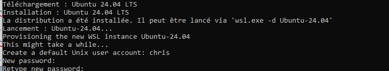
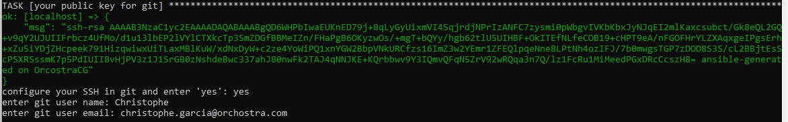

# INSTALL YOUR IT MEMBER ENV

## Clone

clone me

## WSL install
  
On your repository path, launch "install_wps.ps" as Admin. 
  
## Configure Ubuntu on your WPS
  
In WPS Ubuntu's terminal, go to cloned directory.  
  
set your profile dev or ops
  
```bash
cp ./vars/<dev or ops>.spec_packages.yml.dist spec_packages.yml
```
complete your needs packages or repositories

```bash
cd /mnt/c/<your path>-
sh install.sh
```
  
Follow instructions ans take care to prompts


  

